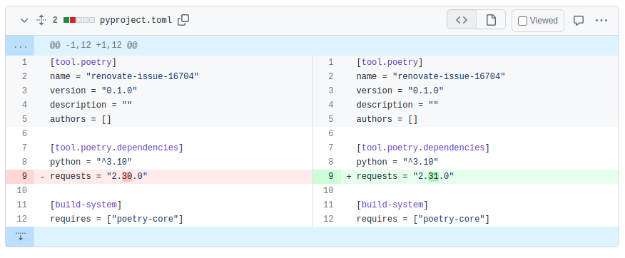
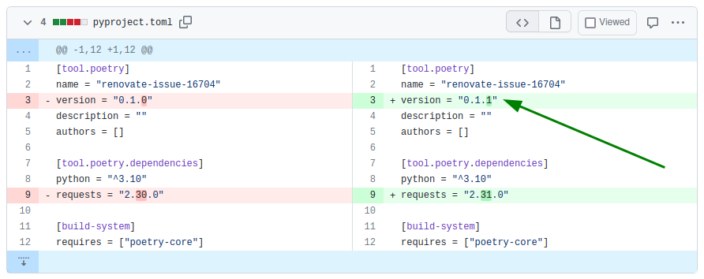

# Add support for setting bumpVersion in Poetry projects (Python)

Minimal reproduction repository for [issues/16704](https://github.com/renovatebot/renovate/issues/16704).

## Current state

In [pull/2](https://github.com/chopeen/renovate-issue-16704/pull/2), Renovate proposed an update
for the `requests` package:

That is correct, but **incomplete**.

## Expected state

With option `"bumpVersion": "patch"`, it should have also executed command `poetry version patch`
to bump the project version:

There is a 1:1 match between `bumpVersion` options and Poetry commands that should be executed:

`bumpVersion` option  | Poetry command
----------------------|-----------------------------
"prerelease"          | `poetry version prerelease`
"patch"               | `poetry version patch`
"minor"               | `poetry version minor`
"major"               | `poetry version major`
